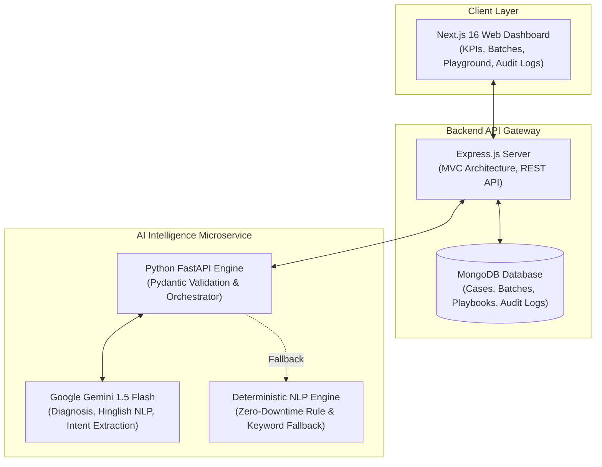

# RazorRecover — Autonomous AI Revenue Recovery System

> **Track 03: AI Revenue Recovery**  
> An autonomous, intelligence-driven payment recovery platform designed for modern merchants. RazorRecover detects payment failures, diagnoses gateway root causes, engages customers with empathetic multi-tone outreach (including natural Hinglish), auto-detects repayment commitments (*Promise-to-Pay*), and strictly adheres to compliance and DND regulations with complete audit trails.

---

## 📑 Table of Contents

- [The Problem](#-the-problem)
- [The Solution](#-the-solution)
- [System Architecture](#-system-architecture)
- [Core Features](#-core-features)
- [Escalation State Machine](#-escalation-state-machine)
- [Tech Stack](#-tech-stack)
- [Project Directory Structure](#-project-directory-structure)
- [Database Schema & Models](#-database-schema--models)
- [API Reference](#-api-reference)
- [Dual-Engine Reliability & Fallbacks](#-dual-engine-reliability--fallbacks)
- [Environment Configuration](#-environment-configuration)
- [Getting Started & Local Setup](#-getting-started--local-setup)
- [Compliance & Security](#-compliance--security)

---

## 🎯 The Problem

In high-growth digital commerce and SaaS, **20% to 30%** of potential revenue is lost to friction in the payment lifecycle:
1. **Silent Technical Failures**: OTP timeouts, 3D-Secure authentication drops, network glitches, and momentary bank downtimes cause orders to drop silently.
2. **Subscription & Invoicing Friction**: Recurring charges fail due to card limit exhaustion, expired mandates, or insufficient funds right before payday.
3. **Blunt, Spammy Dunning**: Traditional tools repeatedly spam customers with generic emails or blindly brute-force card retries, leading to customer churn, bank fraud flags, and negative merchant perception.
4. **Lack of Compliance Safeguards**: Strict regulations (DND/TRAI) require instant cessation of communication upon opt-out, which rigid traditional scripts fail to respect contextually.

---

## 💡 The Solution

**RazorRecover** replaces blunt dunning with an intelligent, multi-stage recovery system:
- **Instant AI Diagnosis**: Interprets raw gateway error logs into plain-language root causes with merchant action recommendations.
- **Empathetic & Localized Outreach**: Crafts personalized recovery messages across **Hinglish**, **Formal English**, and **Casual** styles with dynamic, secure payment checkout links.
- **Promise-to-Pay Intelligence**: Recognizes repayment commitments (e.g., *"salary aane pe pay kar dunga"*) and automatically snoozes outreach until the promised date.
- **Zero-Tolerance Compliance Interceptors**: Instantly halts outreach upon detecting opt-out keywords (`stop`, `dnd`, `unsubscribe`) and maintains an immutable audit log for every transaction.
- **Self-Healing Dual Engine**: Functions seamlessly with Google Gemini 1.5 Flash for advanced NLP, while incorporating a deterministic local rule engine to guarantee 100% operational uptime.

---

## 🏗️ System Architecture



### End-to-End Recovery Flow
1. **Ingestion**: Failed transactions and cart abandonments are ingested individually or in bulk batches.
2. **Diagnosis**: Gateway logs are routed to the Python AI service to determine the underlying failure cause.
3. **Outreach Generation**: Contextual, respectful messages are generated following the merchant's configured tone and escalation rules.
4. **Customer Response Parsing**: Inbound customer replies are analyzed in real time for intent, sentiment, repayment promises, or opt-out demands.
5. **Resolution / Reconciliation**: Real-time payment links update the database, automatically syncing batch recovery statistics and dashboard telemetry.

---

## ✨ Core Features

### 1. Root Cause Diagnosis
Translates cryptic error codes into actionable classifications:
- **Authentication Failures**: OTP timeouts, 3DS authentication drops, biometric verification failures.
- **Balance & Limit Errors**: Insufficient funds, daily transaction ceiling exceeded, expired card credentials.
- **Checkout Abandonment**: Cart abandonment at payment selection, gateway timeouts, processor network downtimes.

### 2. Multi-Tone & Hinglish Outreach
Generates outreach tailored to Indian and global consumer demographics:
- **Hinglish**: Natural conversational Hindi-English blends (e.g., *"Aapka Rs. 3,500 ka payment OTP timeout ki wajah se fail ho gaya..."*).
- **Formal**: Corporate, professional correspondence for enterprise invoicing and B2B SaaS renewals.
- **Casual**: Lighthearted, emoji-assisted friendly reminders for consumer subscriptions and e-commerce carts.

### 3. Promise-to-Pay (PTP) Scheduling
- Understands vernacular and relative date commitments (*"salary 1st ko aayegi"*, *"kal subah pay karta hu"*, *"giving money next Friday"*).
- Calculates the promised date and automatically puts follow-up sequences on hold until the committed timeframe.

### 4. Compliance, Opt-Out & DND
- Intercepts keywords such as `stop`, `dnd`, `opt-out`, `remove`, `unsubscribe`, `legal`, or `fraud`.
- Immediately transitions the case into a `paused` state and locks further communication.
- Records an explicit compliance verification flag in the immutable audit log.

### 5. Interactive Agent Playground
- A dedicated testing sandbox for merchants to simulate conversations in real time.
- Features a **Live AI Cognition Stream** that visualizes the internal reasoning steps: compliance checks, intent classification, sentiment analysis, and response generation.

---

## 🔄 Escalation State Machine

Recovery workflows follow a bounded, four-stage escalation matrix:

| Stage | Level | Action Strategy | Goal |
| :---: | :--- | :--- | :--- |
| **0** | **Alert** | Friendly transaction failure notification with direct payment link | Non-intrusive reminder |
| **1** | **Soft Follow-up** | Inquire if technical assistance or an alternative payment method is needed | Assisted recovery |
| **2** | **Negotiation** | Urgent check-in; highlight pending service suspension or offer discounts | Active resolution |
| **3** | **Hard Warning / Pause** | Final notice; clear compliance stop-word option (*"Reply STOP to halt"*) | Bounded closure |

---

## 🛠️ Tech Stack

| Layer | Technology | Purpose |
| :--- | :--- | :--- |
| **Frontend UI** | Next.js 16, React 19, TailwindCSS | Responsive dashboard, playground, case management |
| **Visualizations** | Recharts, Lucide Icons | Real-time recovery velocity, KPI charts, timeline telemetry |
| **API Gateway** | Node.js, Express.js | REST APIs, business validation, webhook handlers |
| **Database** | MongoDB, Mongoose | Data persistence for cases, batches, playbooks, audit logs |
| **AI Microservice** | Python 3.10+, FastAPI, Uvicorn | High-performance AI service & Pydantic request validation |
| **LLM Engine** | Google Gemini 1.5 Flash | Diagnostic reasoning, Hinglish generation, semantic parsing |
| **NLP Fallback** | Custom Python NLP Engine | Deterministic, zero-downtime offline keyword and rule engine |

---

## 📁 Project Directory Structure

```
RazorPay/
├── ai_agent/                         # Python FastAPI AI Agent Microservice
│   ├── .env                          # AI microservice configuration
│   ├── agent.py                      # Gemini API integration & fallback orchestration
│   ├── main.py                       # FastAPI application endpoints & schema definitions
│   ├── requirements.txt              # Python package dependencies
│   ├── utils.py                      # Local deterministic NLP & regex fallback engine
│   └── venv/                         # Python virtual environment
│
├── backend/                          # Node.js & Express API Gateway
│   ├── config/
│   │   └── db.js                     # MongoDB connection configuration
│   ├── controllers/
│   │   ├── batchController.js        # Batch management & aggregation logic
│   │   ├── caseController.js         # Case lifecycle, outreach & reply handlers
│   │   ├── dashboardController.js    # Metric aggregations & timeline endpoints
│   │   └── playbookController.js     # Tone & stopping rules management
│   ├── models/
│   │   ├── AuditLog.js               # Immutable compliance & action audit schema
│   │   ├── Batch.js                  # Ingested batch entity & stats schema
│   │   ├── Case.js                   # Case state machine, conversations & history
│   │   └── Playbook.js               # Merchant playbooks & recovery configuration
│   ├── routes/
│   │   ├── batchRoutes.js            # Express router for batch endpoints
│   │   ├── caseRoutes.js             # Express router for case operations
│   │   ├── dashboardRoutes.js        # Express router for analytics telemetry
│   │   └── playbookRoutes.js         # Express router for playbook settings
│   ├── .env                          # Backend port & MongoDB URI configuration
│   ├── package.json                  # Node dependencies & scripts
│   └── server.js                     # Express entry point & sample data seeder
│
├── frontend/                         # Next.js 16 Frontend Web Application
│   ├── src/
│   │   ├── app/
│   │   │   ├── batches/page.tsx      # Batch ingestion & tracking interface
│   │   │   ├── cases/page.tsx        # Case inspection & manual action panel
│   │   │   ├── playbooks/page.tsx    # Playbook configuration (tone, rules)
│   │   │   ├── playground/page.tsx   # Interactive real-time AI simulator & cognition log
│   │   │   ├── layout.tsx            # Global layout wrapper with sidebar
│   │   │   ├── globals.css           # Global CSS and Tailwind directives
│   │   │   └── page.tsx              # Executive dashboard with KPIs and charts
│   │   ├── components/
│   │   │   └── Sidebar.tsx           # Navigation sidebar component
│   │   └── utils/
│   │       └── api.ts                # Centralized Axios API client
│   ├── package.json                  # Next.js dependencies & scripts
│   ├── postcss.config.mjs            # PostCSS configuration
│   └── tsconfig.json                 # TypeScript compiler options
│
└── README.md                         # System documentation
```

---

## 📊 Database Schema & Models

### `Case` Schema
- **`batch_id`**: Reference to parent `Batch`.
- **`case_type`**: `payment_failure` | `checkout_abandonment` | `subscription_failed` | `overdue_invoice`.
- **`amount` & `currency`**: Transaction monetary value (e.g., INR).
- **`customer`**: Object with `name`, `email`, and `phone`.
- **`status`**: `pending` | `in_recovery` | `recovered` | `failed` | `paused`.
- **`root_cause`**: AI-diagnosed cause of failure.
- **`escalation_stage`**: Integer from `0` to `3`.
- **`promise_to_pay_date`**: Target date timestamp if repayment promised; `null` otherwise.
- **`conversations`**: Array of timestamped sender/message/channel objects.
- **`history`**: Complete chronological event log of status updates and triggers.

### `Batch` Schema
- **`name`**: Batch identifier label.
- **`status`**: `processing` | `completed`.
- **`total_cases`** / **`recovered_cases`**: Total vs. successfully resolved count.
- **`total_amount`** / **`recovered_amount`**: Financial recovery aggregation.

### `Playbook` Schema
- **`name`**: Playbook identifier.
- **`tone`**: `hinglish` | `formal` | `casual`.
- **`stopping_rules`**: List of opt-out keyword strings.
- **`retry_sequence`**: Array of retry delays in minutes.
- **`channels`**: Supported outreach channels (`email`, `sms`, `whatsapp`).

### `AuditLog` Schema
- **`case_id`** / **`batch_id`**: Associated entity references.
- **`action`**: Name of action performed (e.g., `Compliance Opt-Out`, `Promise to Pay`, `Recovery Success`).
- **`details`**: Explanatory context of the trigger.
- **`actor`**: Initiator (default: `AI Recovery Agent`).
- **`compliance_check`**: Boolean flag marking regulatory enforcement actions.

---

## 🔌 API Reference

### 1. Python AI Agent Endpoints (Port 8000)

#### `GET /health`
Returns the status of the Python microservice.

#### `POST /api/diagnose`
Analyzes technical gateway logs and returns diagnosis.
```json
// Request
{
  "case_id": "60d0fe4f5311236168a109ca",
  "case_type": "payment_failure",
  "amount": 3500,
  "customer_name": "Aarav Sharma",
  "gateway_log": "GATEWAY_TIMEOUT: OTP verification window expired on bank 3DS page."
}

// Response
{
  "root_cause": "Dynamic Authentication Failed (OTP Timeout)",
  "recommendation": "Auto-retry via SMS with localized checkout link."
}
```

#### `POST /api/generate_outreach`
Generates customized outreach in the merchant's chosen tone.
```json
// Request
{
  "case_id": "60d0fe4f5311236168a109ca",
  "case_type": "payment_failure",
  "amount": 3500,
  "customer_name": "Aarav Sharma",
  "root_cause": "Dynamic Authentication Failed (OTP Timeout)",
  "escalation_stage": 0,
  "tone": "hinglish"
}

// Response
{
  "message": "Aarav ji, your payment of Rs. 3500 failed due to OTP delay. Aap niche diye gaye link se retry kar sakte hain: https://rzp.io/l/recv-aaravsharma"
}
```

#### `POST /api/parse_response`
Evaluates customer messages for intent, commitments, or opt-outs.
```json
// Request
{
  "customer_message": "Bhai salary 1st ko aayegi, tab pakka pay kar dunga.",
  "history": [],
  "tone": "hinglish",
  "amount": 3500,
  "customer_name": "Aarav Sharma"
}

// Response
{
  "opt_out": false,
  "promise_to_pay": true,
  "promise_date": "2026-10-01",
  "sentiment": "positive",
  "next_agent_response": "Dhanyawaad Aarav ji. Humne note kar liya hai aur notifications pause kar diye hain."
}
```

---

### 2. Express Backend Endpoints (Port 5000)

| Method | Endpoint | Description |
| :--- | :--- | :--- |
| `GET` | `/api/health` | Service health status check |
| `GET` | `/api/dashboard/kpis` | Summary metrics: total at risk, recovered amount, success rates |
| `GET` | `/api/dashboard/timeline` | Daily aggregated recovery timeline |
| `GET` | `/api/batches` | List all recovery batches |
| `POST` | `/api/batches` | Create a new batch with case items |
| `GET` | `/api/batches/:id` | Get batch details by ID |
| `GET` | `/api/cases` | Filter and retrieve cases (`status`, `batch_id`) |
| `GET` | `/api/cases/:id` | Get single case details including conversation timeline |
| `PUT` | `/api/cases/:id` | Update case status, root cause, or escalation stage |
| `POST` | `/api/cases/:id/outreach` | Trigger AI-generated outreach for the current stage |
| `POST` | `/api/cases/:id/reply` | Submit inbound customer message for AI intent analysis |
| `POST` | `/api/cases/:id/confirm-payment` | Mark case as recovered and update batch totals |
| `GET` | `/api/cases/audit-logs` | Retrieve chronological audit trail records |
| `GET` | `/api/playbooks` | Get active recovery playbook configuration |
| `PUT` | `/api/playbooks` | Update recovery tone, channels, or stopping rules |

---

## 🛡️ Dual-Engine Reliability & Fallbacks

RazorRecover is built with a **fail-safe dual architecture**:

```
                    ┌─────────────────────────┐
                    │ Inbound Cognitive Task  │
                    └────────────┬────────────┘
                                 │
                     [Is Gemini API Active?]
                                 │
                   ┌─────────────┴─────────────┐
                  YES                          NO
                   │                           │
        ┌──────────▼──────────┐     ┌──────────▼──────────┐
        │  Google Gemini 1.5  │     │ Deterministic Local │
        │     Flash Model     │     │      NLP Engine     │
        └──────────┬──────────┘     └──────────┬──────────┘
                   │                           │
                   │ (On Latency / API Error)  │
                   └─────────────►─────────────┘
                                 │
                    ┌────────────▼────────────┐
                    │ Standardized JSON State │
                    └─────────────────────────┘
```

1. **Primary Layer (Gemini 1.5 Flash)**: High-fidelity natural language synthesis, complex vernacular date inference, and contextual reply drafting.
2. **Resilience Layer (Local Regex & NLP Engine)**: Executes immediate rule-based diagnosis, tone-mapped template assembly, and keyword classification if the external API encounters rate limits, network latency, or service interruptions.

---

## ⚙️ Environment Configuration

### Backend (`backend/.env`)
```env
PORT=5000
MONGO_URI=mongodb://127.0.0.1:27017/razorrecover
PYTHON_AGENT_URL=http://127.0.0.1:8000
NODE_ENV=development
```

### AI Microservice (`ai_agent/.env`)
```env
PORT=8000
GEMINI_API_KEY=your_google_gemini_api_key_here
```

---

## 🚀 Getting Started & Local Setup

### Prerequisites
- **Node.js** (v18 or higher) & **npm**
- **Python** (v3.10 or higher) & **pip**
- **MongoDB** running locally on default port `27017`

---

### Step 1: Start the Python AI Agent Microservice
```bash
# Navigate to the agent directory
cd ai_agent

# Activate virtual environment (Windows PowerShell)
.\venv\Scripts\activate
# (On macOS/Linux: source venv/bin/activate)

# Install dependencies
pip install -r requirements.txt

# Start FastAPI server on Port 8000
python main.py
```

---

### Step 2: Start the Express Backend API Gateway
```bash
# Open a new terminal and navigate to the backend directory
cd backend

# Install dependencies
npm install

# Start Express server on Port 5000 (auto-seeds sample data on first run)
npm start
```

---

### Step 3: Start the Next.js Frontend Dashboard
```bash
# Open a new terminal and navigate to the frontend directory
cd frontend

# Install dependencies
npm install

# Start Next.js development server on Port 3000
npm run dev
```

---

### Step 4: Access the Application
- **Frontend Dashboard**: Open your browser at Port 3000.
- **Backend API**: Accessible at Port 5000.
- **AI Microservice**: Accessible at Port 8000.

---

## 🔒 Compliance & Security

- **Zero-Tolerance DND Enforcement**: Opt-out keywords bypass all conversational queuing to halt outreach immediately.
- **Strict Data Segregation**: API keys and database credentials are fully isolated via environment variables.
- **Immutable Audit Logging**: Every system diagnosis, message transmission, and status modification is persistently recorded in the audit trail for regulatory compliance.
- **Deterministic Bounds**: Bounded retry sequences prevent endless loops, protecting merchants from spam compliance violations.
