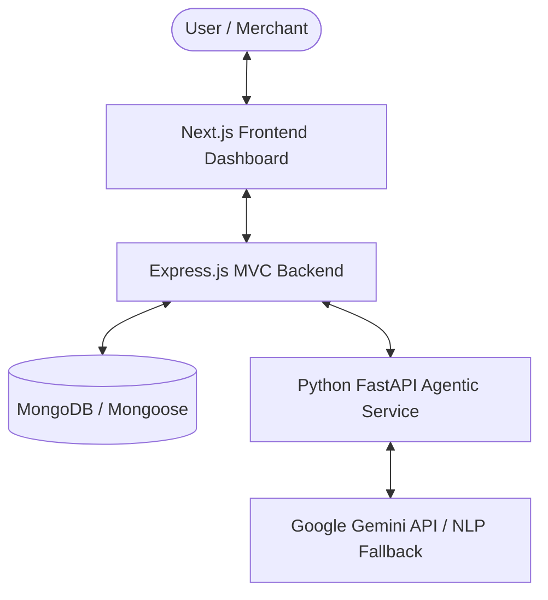

# RazorRecover — AI Revenue Recovery System

> **Autonomous AI-powered revenue recovery system for merchants** (Track 03: AI Revenue Recovery). Detects revenue at risk, diagnoses gateway root causes, and executes bounded, compliant recovery workflows.

---

## 🏗️ System Architecture



---

## 🚀 Core Capabilities

- **Closed-Loop Recovery**: Ingestion $\rightarrow$ AI Diagnosis $\rightarrow$ Escalation Outreach $\rightarrow$ Intent Analysis $\rightarrow$ Payment Confirmation.
- **Root Cause Diagnosis**: Isolates OTP timeouts, 3DS authentication drops, card expiry/limits, and gateway errors.
- **Hinglish & Multi-Tone Outreach**: Contextual messaging in Hinglish, Formal, or Casual tones.
- **Promise-to-Pay Tracker**: Identifies repayment commitments (*"salary day"*, *"kal pay kar dunga"*) and auto-schedules pauses.
- **Compliance & DND**: Instant pause on opt-out triggers (`stop`, `dnd`, `opt-out`) with immutable audit trails.

---

## 📁 Project Structure

```
RazorPay/
├── ai_agent/                     # Python FastAPI AI Agent Microservice (Gemini & NLP Fallback)
├── backend/                      # Node.js & Express API Gateway (MongoDB, Models, Controllers)
└── frontend/                     # Next.js 16 Web Dashboard (TailwindCSS, Recharts, Lucide)
```

---

## 🛠️ Tech Stack

| Layer | Technologies |
| :--- | :--- |
| **Frontend** | Next.js 16, React 19, TailwindCSS, Recharts, Lucide Icons |
| **Backend** | Node.js, Express.js, MongoDB & Mongoose |
| **AI Engine** | Python FastAPI, Google Gemini 1.5 Flash, Pydantic |

---

## ⚡ Quickstart Guide

### 1. Python AI Agent (`:8000`)
```bash
cd ai_agent
.\venv\Scripts\activate
pip install -r requirements.txt
python main.py
```

### 2. Express Backend (`:5000`)
```bash
cd backend
npm install
npm start
```

### 3. Frontend Dashboard (`:3000`)
```bash
cd frontend
npm install
npm run dev
```

Visit **[http://localhost:3000](http://localhost:3000)**.
